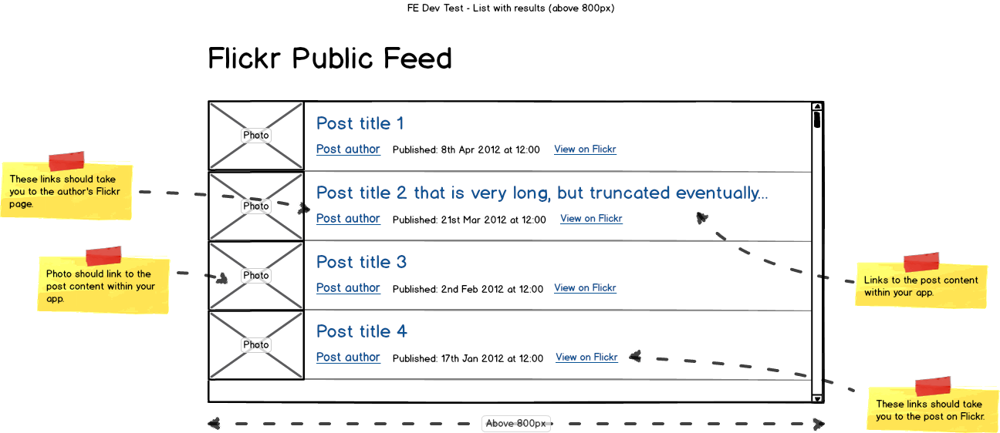
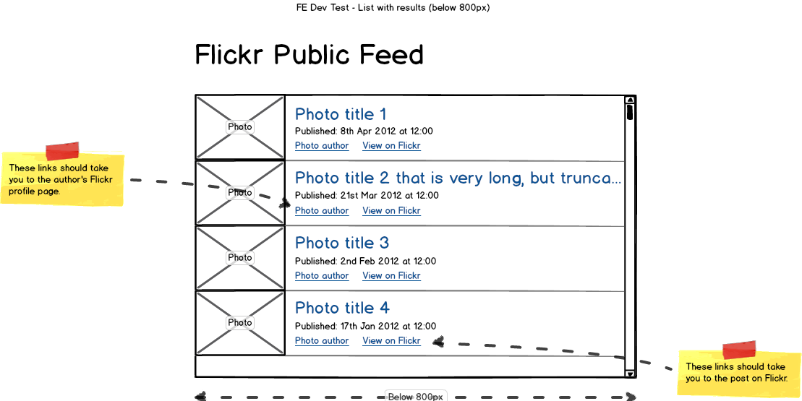
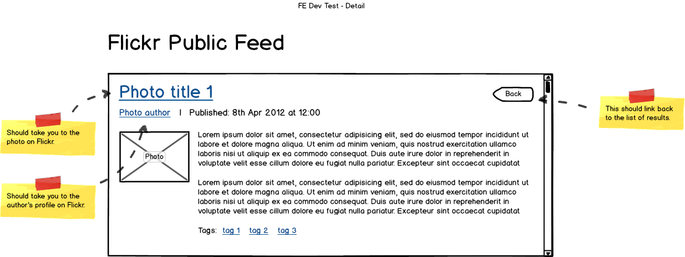

# Flickr Public Feed

##Potato task
### Description

- JSON API feed content displayed in one page app
- responsive layout: according to the wireframes
- used: HTML, CSS, SCSS, JavaScript, Angular.js, JQuery
- plus added:
	-  infinite scrolling
	-  Google +1 button
	-  used Grunt for build process

###Wireframes

